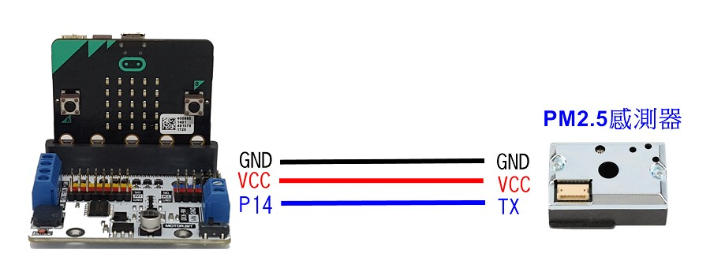
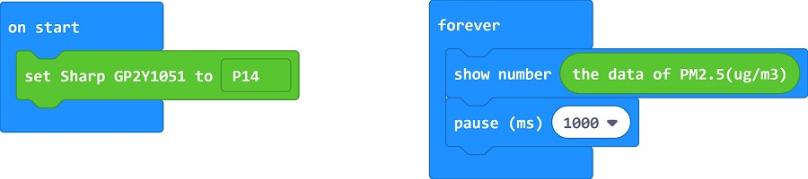

# GP2Y1051

這是專為micro:bit提供的PM2.5感應積木(GP2Y1051)\
This is the blocks for Sharp GP2Y1051 to measure the concentration of PM2.5

## Author
Liou Zheng-Ji\
劉正吉\
[my page, https://sites.google.com/jes.mlc.edu.tw/ljj/](https://sites.google.com/jes.mlc.edu.tw/ljj/)

## Description
The blocks can let you get the data of PM2.5(ug/m3) from the sensor GP2Y1051AU0F.

## Video
[](https://www.youtube.com/watch?v=GyoU2dOg4s0)

## Circuit


## Sample


## License

* MIT

## Supported targets

* for PXT/microbit
(The metadata above is needed for package search.)

```package
GP2Y1051=github:lioujj/pxt-GP2Y1051
```
